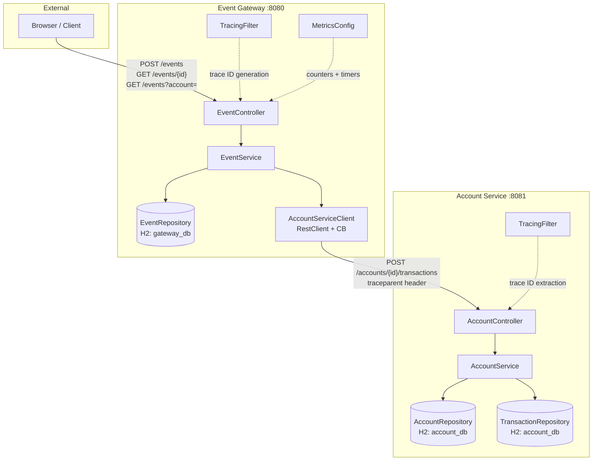
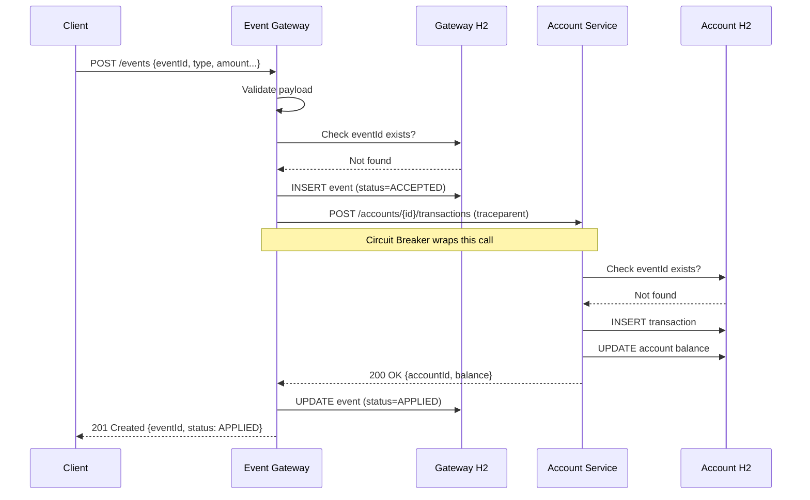
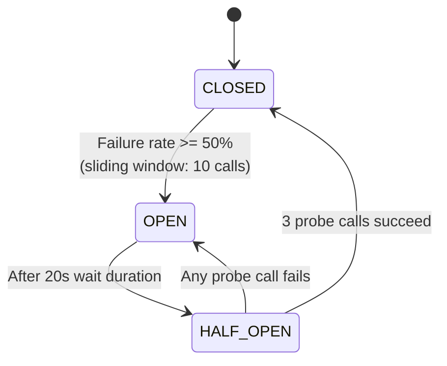

# Event Ledger — Architecture Diagram

## System Architecture

```mermaid
graph TB
    subgraph "External"
        CLIENT[Browser / Client]
    end

    subgraph "Event Gateway :8080"
        GW_CTRL[EventController]
        GW_SVC[EventService]
        GW_REPO[(EventRepository<br/>H2: gateway_db)]
        GW_CLIENT[AccountServiceClient<br/>RestClient + CB]
        GW_FILTER[TracingFilter]
        GW_METRICS[MetricsConfig]
    end

    subgraph "Account Service :8081"
        AS_CTRL[AccountController]
        AS_SVC[AccountService]
        AS_ACCT[(AccountRepository<br/>H2: account_db)]
        AS_TXN[(TransactionRepository<br/>H2: account_db)]
        AS_FILTER[TracingFilter]
    end

    CLIENT -->|"POST /events<br/>GET /events/{id}<br/>GET /events?account="| GW_CTRL
    GW_CTRL --> GW_SVC
    GW_SVC --> GW_REPO
    GW_SVC --> GW_CLIENT
    GW_CLIENT -->|"POST /accounts/{id}/transactions<br/>traceparent header"| AS_CTRL
    GW_FILTER -.->|"trace ID generation"| GW_CTRL
    GW_METRICS -.->|"counters + timers"| GW_CTRL
    AS_CTRL --> AS_SVC
    AS_SVC --> AS_ACCT
    AS_SVC --> AS_TXN
    AS_FILTER -.->|"trace ID extraction"| AS_CTRL
```

## Request Flow

```mermaid
sequenceDiagram
    participant C as Client
    participant GW as Event Gateway
    participant GWDB as Gateway H2
    participant AS as Account Service
    participant ASDB as Account H2

    C->>GW: POST /events {eventId, type, amount...}
    GW->>GW: Validate payload
    GW->>GWDB: Check eventId exists?
    GWDB-->>GW: Not found
    GW->>GWDB: INSERT event (status=ACCEPTED)
    GW->>AS: POST /accounts/{id}/transactions (traceparent)
    Note over GW,AS: Circuit Breaker wraps this call
    AS->>ASDB: Check eventId exists?
    ASDB-->>AS: Not found
    AS->>ASDB: INSERT transaction
    AS->>ASDB: UPDATE account balance
    AS-->>GW: 200 OK {accountId, balance}
    GW->>GWDB: UPDATE event (status=APPLIED)
    GW-->>C: 201 Created {eventId, status: APPLIED}
```

## Circuit Breaker States

```mermaid
stateDiagram-v2
    [*] --> CLOSED
    CLOSED --> OPEN: Failure rate >= 50%<br/>(sliding window: 10 calls)
    OPEN --> HALF_OPEN: After 20s wait duration
    HALF_OPEN --> CLOSED: 3 probe calls succeed
    HALF_OPEN --> OPEN: Any probe call fails
```
