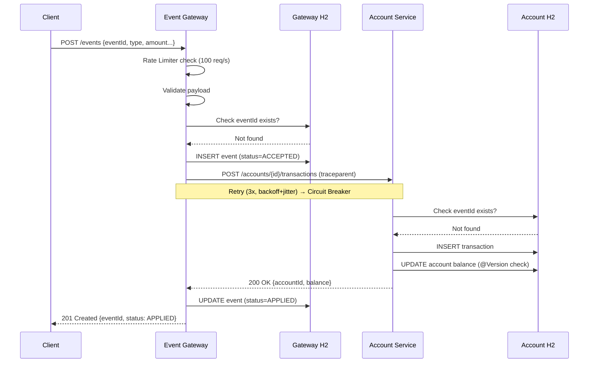
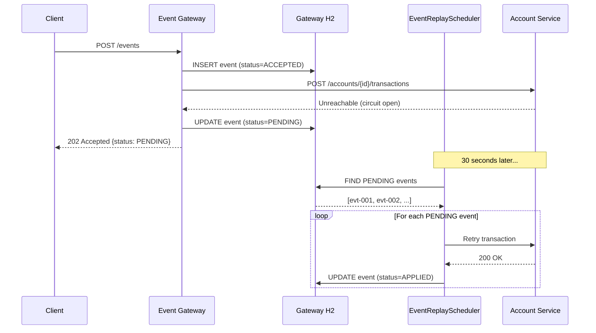
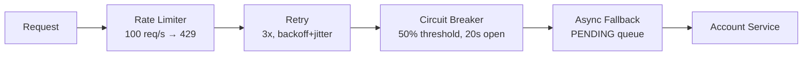
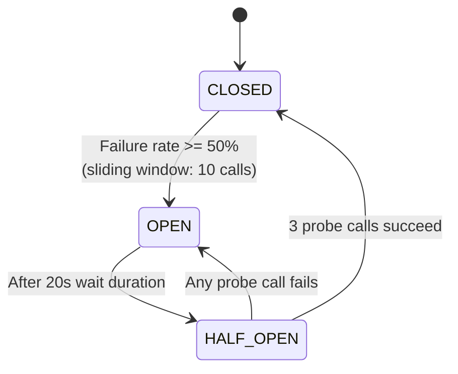

# Event Ledger — Architecture Diagram

## System Architecture

```mermaid
graph TB
    subgraph "External"
        CLIENT[Browser / Client]
    end

    subgraph "Event Gateway :8080"
        GW_RL[RateLimiter<br/>100 req/s]
        GW_CTRL[EventController]
        GW_SVC[EventService]
        GW_REPO[(EventRepository<br/>H2: gateway_db)]
        GW_CLIENT[AccountServiceClient<br/>Retry → CircuitBreaker]
        GW_REPLAY[EventReplayScheduler<br/>@Scheduled 30s]
        GW_FILTER[TracingFilter]
        GW_OTEL[OpenTelemetry SDK]
        GW_METRICS[MetricsConfig]
    end

    subgraph "Account Service :8081"
        AS_CTRL[AccountController]
        AS_SVC[AccountService<br/>@Version optimistic lock]
        AS_ACCT[(AccountRepository<br/>H2: account_db)]
        AS_TXN[(TransactionRepository<br/>H2: account_db)]
        AS_FILTER[TracingFilter]
        AS_OTEL[OpenTelemetry SDK]
    end

    subgraph "Observability"
        JAEGER[Jaeger<br/>:16686 UI]
        PROMETHEUS[Prometheus<br/>:9090]
    end

    CLIENT -->|"POST /events (100 req/s max)"| GW_RL
    GW_RL --> GW_CTRL
    GW_CTRL -->|"GET /events"| GW_SVC
    GW_CTRL --> GW_SVC
    GW_SVC --> GW_REPO
    GW_SVC --> GW_CLIENT
    GW_CLIENT -->|"POST /accounts/{id}/transactions<br/>traceparent header"| AS_CTRL
    GW_REPLAY -->|"retry every 30s"| GW_SVC
    GW_REPLAY --> GW_REPO
    GW_FILTER -.->|"trace ID gen/extract"| GW_CTRL
    GW_OTEL -.->|"spans"| JAEGER
    GW_METRICS -.->|"counters + timers"| GW_CTRL
    GW_METRICS -.->|"export"| PROMETHEUS
    AS_CTRL --> AS_SVC
    AS_SVC --> AS_ACCT
    AS_SVC --> AS_TXN
    AS_FILTER -.->|"trace ID extraction"| AS_CTRL
    AS_OTEL -.->|"spans"| JAEGER
```

## Request Flow (Success Path)



## Request Flow (Async Fallback)



## Resilience Layers



## Circuit Breaker States


